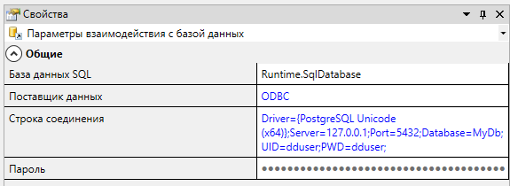

# Простой проект для демонстрации взаимодействия серверной части Альфа Платформы и СУБД 
---------------------------------------------------------------------------------------
1. Данные в примере берутся из PostgresSQL (Название БД 'MyDb')
 
2. Необходимо смоделировать таблицу с именем <u><strong>*node_sql*</strong></u>  состоящую из 2 столбцов (1- Идентификатор 'id', 2-Значения 'valdouble', <strong>для них лучше использовать тип real </strong>) и заполнить ее данными
3. Настройте источника данных в конфигурации ОDBC. Название PostgreSQL35W. Пользователь и пароль dduser ( если его нет в PostgresSQl  добавьте )

4. Запустите проект 
------------------------------------------------------------------------------------------------

## Настройка внутри проекта

    Необходим элемент SQL коннектор в Alpha.Server (  с добавленным источником ).   В текстовом примере находится по адресу OPCUA > Domain > DESKTOP-MHR4BSL > Server

 
 

    Настраиваем источник (В данном случае это RunTime.SqlDatabase)

<H3>Строка подключения </h3>

>  Driver={PostgreSQL Unicode(x64)};Server=127.0.0.1;Port=5432;Database=MyDb;UID=dduser;PWD=dduser;

 

------------------------------------------------------------
### О наболевшем
> Автор от всего сердца ненавидит разработчиков платформы по причине криворукости и дегенеративных приколов уровня Б (см. дальше). Жалобы автора отправленные напрямую в офис разработчиков по адресу Павловское ш., 18, Санкт-Петербург, 196602, до сих пор игнорируются.
------------------------------------------------------------

### На версии '6.0.5.1' имеется <a href="https://pikabu.ru/story/anekdot_pro_nyuans__349792">НЮАНС</a>. А именно неочевидность доступа к полю формирования запросов SqlConnectora к БД. Далее приставлен первый способ, через Табличный вид, однако лучшим из эмпирическим методов было выяснено, что также можно это сделать иначе ( просто сначала я понял это так ¯\_(ツ)_/¯ )

 

    Переходим из 'Диаграмма' в 'Таблица' и открываем настройки коннектора

 

 

    Формируйте запросы к БД

### Альтернативный способ выглядит так

    Выбираем коннектор и смотрим в свойства объекта поле "настройки"

 

    Дважды нажимаем на пустое поле, затем нажимаем в этом поле на три точки. Откроется форма настроек, где можно будет формировать запросы 

 
 

------------------------------------------------------------
### Все не так просто ( и вы сейчас этой поймете )
 
> - Чтобы вставить параметры в запросы или получить их необходимо настроить карту адресов SQL (В примере расположение OPCUA > Domain > DESKTOP-MHR4BSL > Runtime > Application > SqlLinkMap)
> - Также в запросах <u>*ВМЕСТО*</u> названия параметров вбивать символ '?', а <U>*ОЧЕРЕДНОСТЬ*</U> возникновения параметров в sql-запросе задавать в карте адресов 
> - Привязка параметров к запросам(необходимо выбрать номер запроса из настроек коннектора) осуществляется в карте адресов
 > - В поле Value надо задать такое же название как и название получаемого столбца из БД 
    
------------------------------------------------------------
 

 

     Выглядит это примерно так

 
  

     Пример запроса 4 на обновление значения в БД с двумя параметрами

